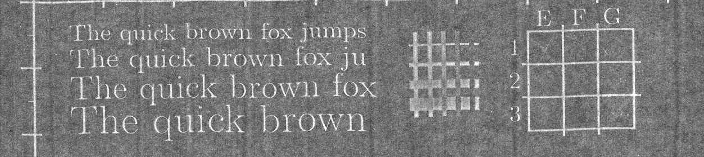

# Fully automatic virtual unwrapping method for documents imaged by X-ray tomography.
Official code and visualization of results for the article
`Fully automatic virtual unwrapping method for documents imaged by X-ray tomography`.

Automatic pipeline for “virtual unwrapping” of 6 test objects with 3 types of twist and calculation of quality assessment functionals; an example of the resulting unwrapping is presented below. The pipeline consists of a neural network for segmenting the tomographic reconstruction of a document, an unfolder designed to obtain an unfold, and a python script for calculating quality assessment functionals and calculating affine transformation coefficients.

## Project structure
The `NN_python` folder contains the segmentation neural network.

The `unfolder` folder contains code with which the final scan is restored based on the results of segmentation of the neural network.

The `metrics_vis` folder contains code for visualizing and assessing the quality of the resulting scan.

The `scans` folder contains scans at 300 dpi, a comparison of markers of the scan and 3D reconstructions.

The `results` folder contains the output parameters as a result of the algorithm for 6 test objects.

The `folded001_noise_mask` folder contains the noise mask for folded001 object.

## Data preparation

To reproduce the results of the article, you need to download tomographic reconstructions from the site `https://zenodo.org/records/7324269`.

## Required dependencies

To run, you need a compiler with C++17 support, python3 version 3.6 or higher. CMake version 3.0 or higher.

Install the required python libraries using the command

`pip install -r NN_python/requirements.txt`

Also install the OpenCV, nlohmann_json libraries for C++.

## Launch of the project
To run pipeline, you need to set the config parameters `main_config.json`.

You also need to build the C++ project located in the `unfolder` folder.

The automatic pipeline is launched from the `NN_python` folder using the command: `python run.py ../main_config.json`.

## Output parameters

As a result of the pipeline, files with 2 resulting unfoldings will appear in the `UNFOLDING_PATH` folder: `SCROLL_ID.1.300_dpi.png`, `SCROLL_ID.2.300_dpi.png`, a file with a comparison of markers of the scan and 3D reconstruction: `SCROLL_ID.unfolding_3d.txt `, a text file with the parameters of the affine model: `SCROLL_ID.aff_params.txt`, a text file with the values of the model quality assessment functionality: `SCROLL_ID.estimation.txt`, a histogram of the distribution of residuals in the resulting affine model: `SCROLL_ID.hist.png` and visualization of the comparison of markers on the unfolding and scan: `SCROLL_ID.1.correspondence.png`, `SCROLL_ID.2.correspondence.png`.

## Config parameters

`SCROLL_ID` - a string with the name of the sample, used only for the purpose of write images

`SCALE_300DPI` - scaling factor for 300dpi resolution

`FLIP_VERT_UNFOLDING_BOOL` - bool, whether it is necessary to do a vertical flip of the scan during the algorithm

`FLIP_HORI_UNFOLDING_BOOL` - bool, whether it is necessary to do a vertical flip of the scan during the algorithm

`ROTATE_90_UNFOLDING_BOOL` - bool, whether it is necessary to rotate the scan by 90 degrees during the algorithm

`FOLDER_PATH_SLICES` - path to the folder with reconstructions in png or tif format

`FILE_PATH_NUM_PATH` - path to a text file with a list of slice numbers for segmentation

`FILE_PATH_SCAN` - path to scan at 300 dpi

`FILE_PATH_SCAN_3D` - path to the text file comparing markers of the scan and 3D reconstruction

`FILE_PATH_NN_WEIGHTS` - path to the weights of the neural network

`NN_INFERENCE_DEVICE` - device type: `cpu` or `gpu` on which the neural network runs

`NN_INFERENCE_MEMORY_Mb` - in Megabytes, the amount of available RAM or memory on the GPU in accordance with the selected device type

`FOLDER_PATH_MASK` - path to the folder with binary segmentation masks

`FOLDER_PATH_FINAL` - path to the folder for writing out the final results of the pipeline

`WRITE_UNNECESSARY_DETAILS` - bool, whether additional visualizations and other files should be saved to the `FOLDER_PATH_DETAILS` folder

`FOLDER_PATH_DETAILS` - path to the folder to which additional files will be saved

Note that in any case, the `FOLDER_PATH_DETAILS` folder will be created, but in the case of `WRITE_UNNECESSARY_DETAILS = false` only the files necessary for the pipeline to work will be saved.

P.S. In the case of `SCROLL_ID` = `folded001`, a new field `FOLDER_PATH_NOISE_MASK` is introduced, which specifies the path to the folder with a mask to remove interference for `folded001`.

## System requirements

To fully reproduce the results, it is necessary to allocate at least 19 GB of additional memory (not including memory for loading reconstructions). To download all reconstructions, 356 GB of disk memory is required.

| Sample | Required amount of GPU memory | Required amount of additional hard drive memory for algorithm | Required amount of additional hard drive memory for reconstructions  |
| --- | --- | --- | --- |
| scroll001 | 3400 Mb  | 2.0 Gb | 14.2 Gb |
| scroll002 | 2900 Mb | 2.1 Gb | 15 Gb |
| scroll003 | 10200 Mb | 2.1 Gb | 58.5 Gb |
| scroll004 | 10200 Mb | 2.1 Gb | 63.5 Gb |
| folded001 | 4700 Mb | 5.3 Gb | 128 Gb |
| folded002 | 6000 Mb | 5.0 Gb | 75.9 Gb |

